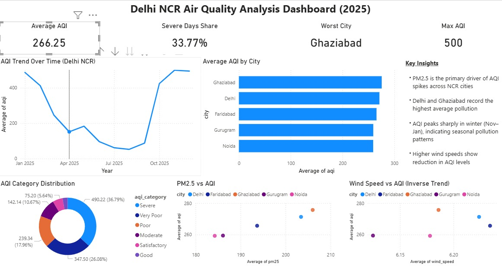

# Delhi NCR Air Quality Analysis

## 📊 Project Overview
This project analyzes air quality trends across Delhi NCR using SQL and Power BI.

## 🛠 Tools Used
- SQL (MySQL)
- Power BI
- Python (data cleaning)

## 📈 Key Insights
- AQI peaks during winter months, showing strong seasonal pollution patterns  
- PM2.5 is the primary driver of AQI levels  
- Some days show significantly lower AQI, indicating occasional improvement in air quality  

## 📷 Dashboard Preview

